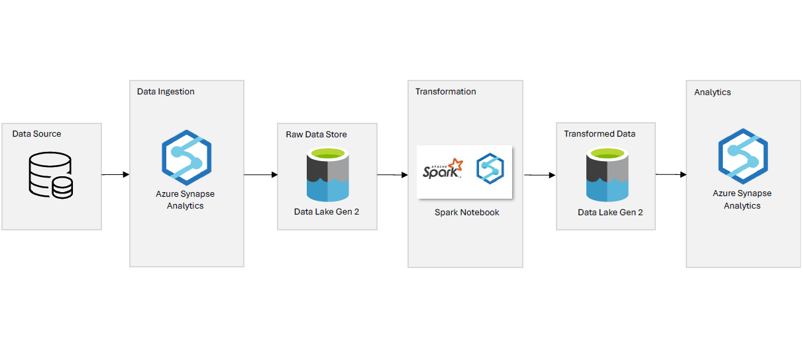

# Tokyo Olympic | Azure Data Engineering Project

## Description
This project showcases data engineering on Azure using Tokyo Olympics data sourced from Kaggle and uploaded to this repository.

## Architecture

## About Dataset
This dataset includes details of over 11,000 athletes across 47 disciplines and 743 teams participating in the 2021 (2020) Tokyo Olympics. It provides information on athletes, coaches, and teams, as well as entries by gender. The dataset contains names, represented countries, disciplines, competitor genders, and coaches' names.

Source(Kaggle): [2021 Olympics in Tokyo](https://www.kaggle.com/datasets/arjunprasadsarkhel/2021-olympics-in-tokyo)

## Azure Services Used
1. Azure Data Lake Storage Gen 2: Primary storage for raw and transformed data
2. Azure Synapse Analytics: Ingestion, Pipeline and Data Warehouse and Analytics
   - Notebook: Data Transformation
   - Lake Database: Table Storage for analytics
   - Pipeline: For-Loop activity (Copy Data activity) and Notebook activity.

## Workflow
### Pipeline

### Ingestion
1. For data ingestion, I utilized Azure Synapse Analytics.
2. To streamline the process and prevent redundant creation of the copy-data activity, I employed a for-loop activity integrated with the copy-data activity.

   
   
3. I defined an array of variables containing table names.
   
   
   
4. These table names were used by the for-loop activity to iterate through and perform the necessary data copying operations.
   
   

### Transformation
I performed data transformation using the Spark Notebook in Azure Synapse Analytics.

### Analytics

